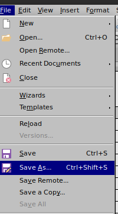
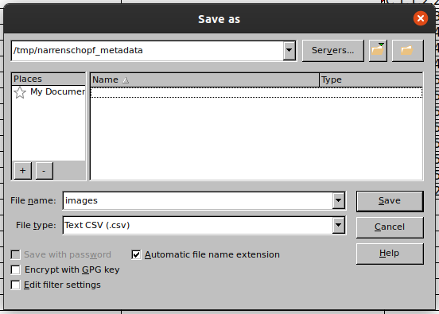
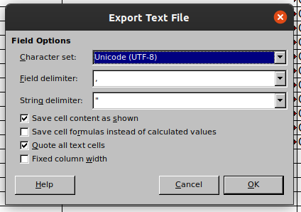

# Metadata import for https://enter.museum4punkt0.org

`rs-import` is a command-line interface (CLI) to that reads metadata of digital
objects provided as csv-file(s), generates RDF triples and submits these to the
[ResearchSpace](https://www.researchspace.org/) instance available at
https://enter.museum4punkt0.de/. The generated data conforms with the
[project's documentation ontology](https://github.com/fdiehr/enter-ontology),
while the mapping of csv to RDF data is documented in
[a supplemental document](./SPECIFICATION.md) in the tool's sources.

## Prerequisites

- the command-line tool is installed (see below)
- a configuration file with connection information is available (see below)
- the actual data has been uploaded and is available on the web
- the metadata is converted from a spreadsheet format to a comma separated
  value text file (see below)
- the metadata itself is described in a file (see below)

## Installing the tool

TODO

## Configuration file

The user needs to have a configuration file present on the system s/he's using
this tool on. It is to be formatted with [YAML](https://yaml.org/) syntax and
must contain these keys:

- `media_types`
  - this mapping provides unambiguous IRIs for ambiguous filename extensions of
    the digital objects
  - all used filename extensions must be specified here
  - the IRIs must be used consistently across the project; in case of changes,
    previously imported metadata should be re-imported
- `sparql_endpoint`
  - the URL where the instance's SPARQL interface is available
- `sparql_user`
  - the name of a user of the platform that is allowed to add data
- `sparql_pass`
  - the password of that user

By default the tool will look in the user folder for a file named
`.rs-import.yml`, but it can also specified with the `--config` flag on
invocation. It would roughly look like this:

```yaml
---

media_types:
  jpeg: https://www.iana.org/assignments/media-types/image/jp2
  jpg: https://www.iana.org/assignments/media-types/image/jp2
  tif: https://www.iana.org/assignments/media-types/image/tiff
  tiff: https://www.iana.org/assignments/media-types/image/tiff
  zip: https://www.iana.org/assignments/media-types/application/zip

sparql_endpoint: https://enter.museum4punkt0.de/sparql
sparql_user: editor
sparql_pass: sEcr3t
```

## Converting the provided spreadsheets to csv text files

Most spreadsheet applications allow to save/export the tabular data to text
files that contain a comma-separated representation of that data. Here's an
example flow that uses [LibreOffice](https://www.libreoffice.org/):







Mind that each table is to be saved separately with the designated filename of
the digital object type (`images.csv`, `audio_video.csv`, `3d.csv`)
respectively as `entities.csv`. Empty tables are not required to be saved.

Make sure to remove the first line that contains usage hints from the resulting
file.

## Preparing and describing the dataset

The aforementioned resulting files must be saved to a separate folder (*import
folder*) for each set of metadata. Of course, also the metadata needs to be
described. This file is again in YAML syntax, must be named `dataset.yml`,
reside in the import folder and requires two keys to be defined:

- `file_namespace` is the base URL where the digital objects can be found by
  the filename noted in the metadata.
- `data_provider` is an IRI that identifies the providing institution.

Here's an example:

```yaml
---

file_namespace: "https://objekte.museum4punkt0.de/narrenschopf/"
data_provider: "http://www.vsan.de/"
```

## Using the tool

The tool can print a brief description of the expected arguments and options:

```
$ rs-import --help
usage: rs-import [-h] [--config PATH] [--verbose] [--review]
                 IMPORT_PATH [IMPORT_PATH ...]

This tool takes the contents of the specified import folders, transforms them
into SPARQL statements and submits these to a SPARQL endpoint.A detailed log
file will always be stored in a folder `logs` within each import folder. Please
refer to the supplied usage documentation and specificationfor more details.

positional arguments:
  IMPORT_PATH    The folder(s) containing the import data.

optional arguments:
  -h, --help     show this help message and exit
  --config PATH  The path to the configuration file. Default: ~/.rs-import.yml
  --verbose, -v  Increases verbosity to DEBUG level.
  --review       Review and confirm the generated SPARQL update before
                 submitting.
```

So, assuming that the configuration file is located at the default location and
the *current working directory* named `imports` contains two folders with
metadata like this:

```
imports/
├── bambule
│   ├── dataset.yml
│   └── audio_video.csv
└── narrenschopf
    ├── dataset.yml
    ├── entities.csv
    └── images.csv
```

The tool would be invoked to import both folders' contents consecutively:

    rs-import bambule narrenschopf

## Further hints

Both, the designated script to upload the digital objects and this tool,
normalize filename extensions to be lower case. E.g. `image.TIFF` becomes
`image.tiff`.

Imports can be re-done. Any previously imported metadata for the specified
`file_namespace` is deleted.
